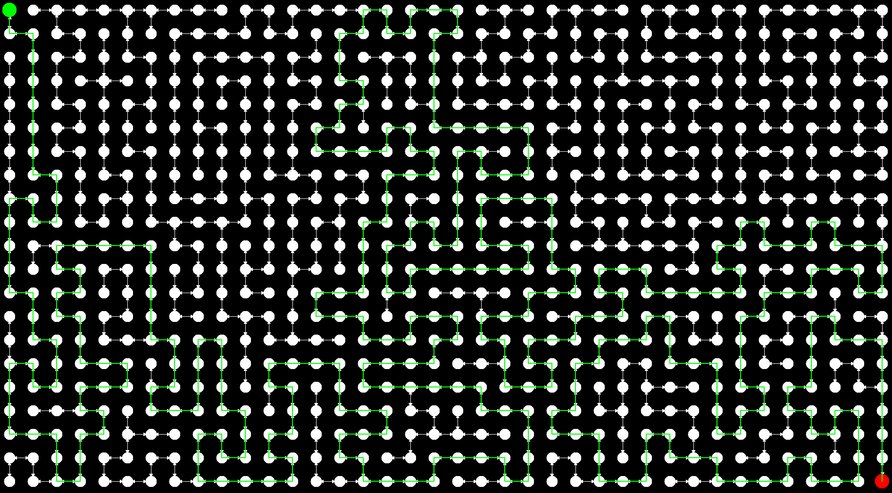

# Gruphi - Die Graph GUI



Um diese GUI nutzen zu müssen,
muss man die H1,
sprich die Klasse `h07.graph.DirectedGraphImpl`,
implementiert haben
und eine Entsprechende Fabrik in der `Gruphi.main()` angeben.
Die Einfachste Fabrik sieht in etwa so aus:

```java
public class EmptyGraphFactory<V, A> implements DirectedGraphFactory<V, A> {

    @Override
    public DirectedGraph<V, A> createDirectedGraph() {
        return new DirectedGraphImpl<>();
    }
}
```


# Streuerung

- `C`:
Graphen leeren 

- `G`:
Graphen leeren und raster erzeugen
  
- Linke Maustaste:
Knoten erstellen

- Rechte Maustaste:
Knoten auswählen
  
- Escape, `Q`:
Beenden

## Wenn Knoten ausgewählt (rot)

- WASD, Pfeiltasten, Vimkeys:
Knoten bewegen

- Linke Maustaste:
Verbingen erstellen bzw. löschen,
wenn anderer Knoten geklickt.
Sonst Knoten teleportieren

- Rechte Maustaste:
Knoten unauswählen,
bwz. neuen Knoten auswählen
  
- `M`:
Labyrinth mit Knoten
erstellen als Startknoten generieren